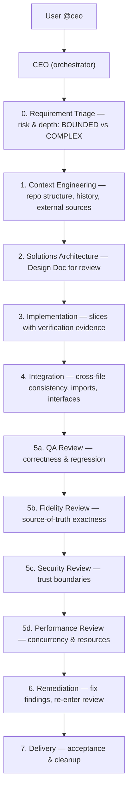

# Planning → Implementation → Audit Pipeline — CEO Orchestrator with Task()

*Source: https://github.com/galpt/kilocode-agents (CEO pipeline, 16 agents, flowchart) + https://blog.kilo.ai/p/how-7-kilo-code-engineers-run-up (plan harder, implement faster; verification loops)*
*Author: galpt/kilocode-agents, Darko Gjorgjievski — May 2026*

> The harness that makes 7 Kilo engineers ship at “Kilo Speed” is not a prompt — it’s a **tool-enforced pipeline** where a `ceo` orchestrator routes through **triage → context → architect → implement → integrate → multi-track review (QA/fidelity/security/performance) → remediate → deliver**, each stage via `Task(subagent_type="...")`. Skipping a stage errors. Reviews are separate sessions that feed a structured **remediation loop** before delivery. Plan with a slow thinker, implement with a fast one, and let fresh reviewers verify.

---

## Table of Contents

- [Why a pipeline, not a prompt](#why-a-pipeline-not-a-prompt)
- [The 9 stages (enforced)](#the-9-stages-enforced)
- [The 16 agents](#the-16-agents)
- [How CEO orchestrates via Task()](#how-ceo-orchestrates-via-task)
- [Plan harder, implement faster — model harness](#plan-harder-implement-faster--model-harness)
- [Transparent review → structured remediation](#transparent-review--structured-remediation)
- [Example: add transactional outbox to orders](#example-add-transactional-outbox-to-orders)
- [Checklist](#checklist)
- [Common mistakes](#common-mistakes)
- [FAQ](#faq)

---

## Why a pipeline, not a prompt

A single `code` prompt that says “add outbox, wire Debezium, update tests, handle lag SLOs” *will* run out of context before `replay from 0` is correct. Quality drops around **60% context fill**, well before compaction at 95% [blog.kilo.ai, Igor]. Splitting via subagents keeps each session small enough to finish before auto-compression hallucinates.

> “Refactor this service, improve performance, add analytics, and clean up tests” is **four agent tasks, not one** [blog.kilo.ai, GCCD].

The `ceo` pipeline makes that split *enforced*, not suggested — `Task()` tool errors if you skip a stage [galpt/kilocode-agents].

## The 9 stages (enforced)



- **0. Triage** — `requirement-triage` classifies task as `BOUNDED` (one repo, one bounded context) or `COMPLEX` (spanning contexts, long-running). COMPLEX gets the full pipeline; BOUNDED may skip integrate/review lanes.
- **1. Context** — `context-engineer` + `repo-explorer` gather structure, history, and external sources (Context7) into a **Context Brief** — not ad-hoc grep buried in a prompt.
- **2. Architect** — `solutions-architect` designs from the Brief, produces a **Design Document** for review *before* any code. This is the “slow thinker” stage.
- **3. Implement** — `implementer` executes the design in **atomic, verifiable slices** — each slice ships with test/log evidence.
- **4. Integrate** — `integrator` connects slices, checks cross-file imports/interfaces, ensures `OrderAggregate` and `Inventory` agree on `orderId`.
- **5. Review (multi-track, parallel)** — `qa-reviewer`, `fidelity-reviewer`, `security-reviewer`, `performance-reviewer` run **independent sessions** (no attachment to the code they review). One may catch “fixed hydration but CSP nonce still missing” that the writer missed.
- **6. Remediate** — `remediator` fixes findings, re-runs verification, re-enters the review gate until all pass.
- **7. Delivery** — `delivery-manager` verifies acceptance, cleans up, and ensures the plan was implemented.

Every significant decision passes a visible approval gate.

## The 16 agents

| Agent | Role | Mode |
|---|---|---|
| `ceo` | Primary orchestrator — routes to right stage via `Task()` | `primary` |
| `requirement-triage` | Risk & depth classification | `subagent` |
| `context-engineer` | Context gathering & synthesis | `subagent` |
| `solutions-architect` | Technical design & planning | `subagent` |
| `implementer` | Code slices with verification | `subagent` |
| `integrator` | Cross-file consistency | `subagent` |
| `remediator` | Fix review findings | `subagent` |
| `delivery-manager` | Acceptance & cleanup | `subagent` |
| `scrum-master` | Sprint planning & breakdown | `subagent` |
| `product-manager` | Requirement quality & scope | `subagent` |
| `repo-explorer` | Codebase mapping & discovery | `subagent` |
| `qa-reviewer` | Correctness & regression | `subagent` |
| `fidelity-reviewer` | Source-of-truth exactness | `subagent` |
| `security-reviewer` | Security & trust boundaries | `subagent` |
| `performance-reviewer` | Concurrency & resources | `subagent` |
| `devops-engineer` | CI, build, release tooling | `subagent` |

All 16 are Markdown files in `.kilo/agent/` — the canonical source; `vscode/agents.json` is derived for Settings import. `mode: subagent` means hidden from picker, only delegated.

## How CEO orchestrates via Task()

CEO never writes code directly — it *delegates*:

```ts
// Pseudo — what ceo does internally (you invoke as @ceo)
await Task(subagent_type="requirement-triage", prompt="Classify: add transactional outbox to orders — bounded?");
await Task(subagent_type="context-engineer", prompt="Gather context: repo, history, Outbox pattern docs");
await Task(subagent_type="solutions-architect", prompt="Design: outbox table, relay (poll vs CDC), consumer dedup");
await Task(subagent_type="implementer", prompt="Slice 1: outbox table + same-TX insert");
await Task(subagent_type="integrator", prompt="Check cross-file: OrderAggregate → outbox consistency");
await Task(subagent_type="qa-reviewer", prompt="Review correctness: dual-write eliminated?");
await Task(subagent_type="security-reviewer", prompt="Review: HttpOnly session not needed here, but Outbox replay poisoning?");
// Any reviewer failure → Task(subagent_type="remediator", prompt="Fix findings ...") → re-enter review
await Task(subagent_type="delivery-manager", prompt="Verify acceptance: p95 4s JOINs gone?");
```

Skipping a stage (e.g., `implementer` before `solutions-architect`) returns a tool error — the pipeline is **enforced**, not suggested.

**Setup:**

```bash
# CLI
cp -r path/to/kilocode-agents/kilo-cli/.kilo ./
kilo  # @ceo <your task>

# VS Code
Settings → About → Import Settings → select vscode/agents.json → @ceo
```

## Plan harder, implement faster — model harness

**Florian’s queue:** Research agents in `Plan` mode prepare plans for tasks he wants to do; by the time planning finishes, he has a queue of pre-investigated problems ready for execution agents [blog.kilo.ai, Florian].

**Imanol/Kirill pattern:** Slow thinker for plan (GPT-5.5 Thinking, Claude Opus) → fast for implement (GPT-5.5 Fast, Sonnet “so much better” vs fast-plan → slow-implement). Boris Cherny: “Once there is a good plan, it will one-shot the implementation almost every time.”

**For you:** Pin `solutions-architect` to `anthropic/claude-opus-4` (thinking), `implementer` to `anthropic/claude-sonnet-4` (fast). Kilo’s **sticky models** remember per agent — switching via `@ceo` switches models automatically.

## Transparent review → structured remediation

**Why separate reviewers?** “The person who wrote the code is worst to review it.” A fresh session has no attachment [blog.kilo.ai]. So:

- `qa-reviewer` — correctness, regressions, test coverage
- `fidelity-reviewer` — did the code match the Design Doc and source of truth? (e.g., `cqrs-logical-vs-physical.md` vs spec)
- `security-reviewer` — trust boundaries, auth in `beforeLoad` vs server function, CSP nonces
- `performance-reviewer` — N+1, lock contention, buffer pool, lag SLOs

**Florian’s PR-review-feedback agent:** reviewer leaves comment → OpenClaw agent on KiloClaw reads it, makes changes, messages back. Multiply by hundreds of PRs — saved time compounds.

**Remediation loop:** Findings → `remediator` fixes → re-runs verification → re-enters review gate until all lanes pass. No “LGTM” without evidence.

## Example: add transactional outbox to orders

1. **User:** `@ceo Add transactional outbox to orders — Postgres + Debezium, retry & DLQ`
2. **CEO → triage:** `COMPLEX` (spans orders, inventory, payments)
3. **Context:** `repo-explorer` maps `src/routes/orders`, `src/db/schema`; Context7 pulls `transactional-outbox-pattern.md` source
4. **Architect:** Design Doc with `outbox(id, aggregate, type, payload, published)` + poll relay vs Debezium CDC, dedup `processed_events`, `freno` lag, re-runs `SOLID` check
5. **Implement (slice 1):** `implementer` adds `outbox` migration + `INSERT outbox` in same TX as `orders`
6. **Integrate:** `integrator` verifies `OrderAggregate` and `Inventory` agree on `orderId` correlation
7. **Review:** `qa-reviewer` catches “dual-write still in `InventoryReserved` handler” → `security-reviewer` catches “no `Origin` check on relay webhook”
8. **Remediate:** `remediator` fixes both, re-runs `npm run build` evidence
9. **Deliver:** `delivery-manager` checks `p95 4s` JOIN gone, cleans up, writes `skills/transactional-outbox.md` for next similar task

## Checklist

- [ ] Task invoked as `@ceo <task>` — not direct `@code`
- [ ] Each stage delegated via `Task(subagent_type="...")` — no prompt skipping
- [ ] Context Brief and Design Doc reviewed before Implement
- [ ] Slices are reviewable in one sitting (if diff too large, split)
- [ ] All 4 review lanes (or relevant subset) run in independent sessions
- [ ] Findings feed `remediator` → re-enter review until pass
- [ ] Model harness: slow for `plan`/`architect`, fast for `implement`

## Common mistakes

- **Mixing plan and implement contexts:** Keep them separate — plan writes the plan, orchestrator executes it. Never paste a 200-line plan into the same context that will implement it.
- **“One task” that’s four:** Use GCCD — goals, constraints, context, deliverables — to split before `Task()`.
- **Skipping integration:** Slices look green alone, fail on cross-file imports — `integrator` exists for that.
- **Reviewer attachment:** Don’t let the implementer review its own code — fresh session is stricter.

## FAQ

**Can I use this pipeline without 16 agents?** Yes — `ceo` will select the subset needed based on triage `BOUNDED` vs `COMPLEX`. You can also hide unused agents (`hidden: true`).

**CLI vs VS Code — same agents?** Yes — both read the same `.kilo/agent/*.md` files; VS Code is built on the CLI backend.

**Do I need all review lanes?** No — pick per task: `qa-reviewer` almost always, `security-reviewer` for trust boundaries, `fidelity-reviewer` when source-of-truth exactness matters.

---

## Takeaway

Plan with the `ceo` orchestrator, not a single prompt: `Task()`-enforced triage → context → architect → slice-based implement → integrate → *parallel* independent reviews → remediate → deliver. That’s how a one-off “add outbox” becomes a harness that remembers `skills/transactional-outbox.md` and makes the next similar task one-shot.

*Tags: ceo, orchestrator, Task, pipeline, requirement-triage, context-engineer, solutions-architect, implementer, integrator, reviewer, remediator, delivery-manager, agentic-swe*
